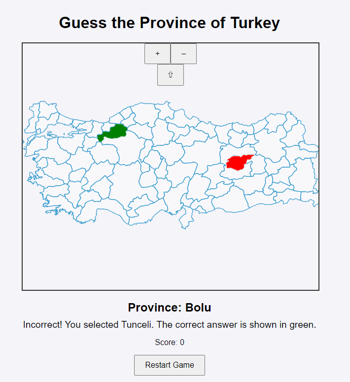

# Guess the Province of Turkiye

This is an interactive web-based geo-game inspired by Seterra, designed to help players learn and test their knowledge of Turkiye's 81 provinces. Players are prompted to identify provinces on the map, with correct guesses highlighted in green and incorrect guesses in red. The game features randomized province selection each round and includes a scoring system. The game is built with HTML, CSS, JavaScript, and OpenLayers for map interaction.

## Features

- **Interactive Map**: Built with OpenLayers to provide a map of Turkiye with all provinces.
- **Randomized Province Order**: Each game randomizes the order of provinces to test players' knowledge.
- **Visual Feedback**: 
  - Correct selections are highlighted in green.
  - Incorrect selections show the chosen province in red and the correct answer in green.
- **Scoring and Restart Functionality**: Tracks player’s score and allows the game to restart at any time.
- **Astonishing facts about the provinces**

## Screenshots

)

## How to Play

1. The game will display the name of a province for the player to locate on the map.
2. Click on the map to select the province you think matches the displayed name.
   - **If correct**: The selected province will be highlighted in green, and your score will increase.
   - **If incorrect**: The selected province will be highlighted in red, while the correct province will be highlighted in green. The feedback will also indicate the incorrect selection.
3. Proceed to the next question until all provinces are answered.
4. Use the "Restart" button to reset the game and play again.

## JS Libraries Used in the Project

1. OpenLayers(ol)

-  OpenLayers is a high-performance, open-source library for building interactive maps. In this project it is used to display the provincial map of the Turkiye with GeoJSON format.
-  It presents opportunity to state the correctivity of the chosen answer related with the asked question during the flow of the quiz with visual response.
-  One of the reasons for chosing the library is, its open-source availability and easiness of usage it presents.

2. Native JavaScript APIs

sessionStorage: A useful library that handled the temporarily storage of the performance of the player.
date: To observe and display the time elapsed during each round.
DOM(Document Object Model) Manipulation APIs: Its purpose of usage was displaying the feedback messages.
setInterval & clearInterval: Both used for functionality of the countdown.

3. GeoJSON

-  Used for accessing the geographical data of Turkiye restored in github with open-source sharing principles.
